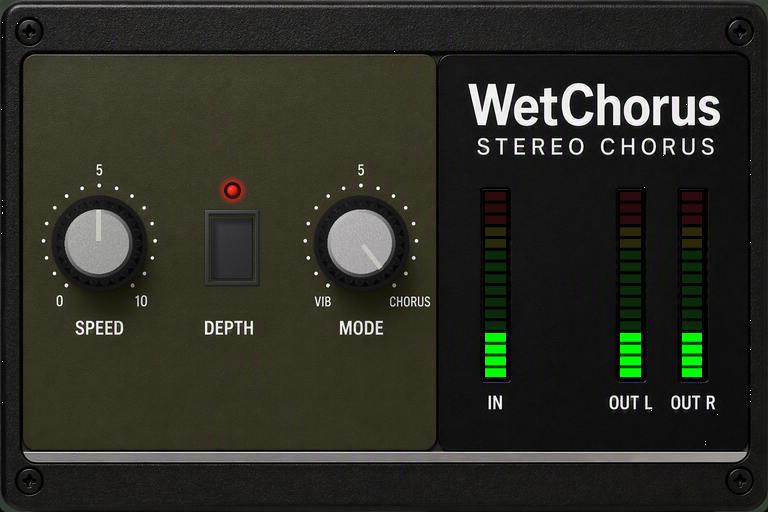

# WET Chorus VST3 Plugin


[](https://github.com/yonie/WetChorus/releases/latest)

A bucket-brigade stereo chorus VST3 plugin, modelled as the circuit rather than as a delay line with an LFO on it, with the moving clock, compander breathing and audible noise floor of the chorus built into a 1970s solid-state guitar combo.



> **Panel too big or too small?** Right-click anywhere on the panel and pick **UI Zoom** - 75%, 100% or 125%.

## Features

- **100% Wet**: Both outputs are the modulated voice at every setting - the width comes from two voices moving against each other, not wet against dry. No mix control
- **One Knob From Vibrato To Chorus**: MODE sweeps the LFO phase between the voices - together at VIB, a quarter cycle apart in the middle, opposed at CHORUS
- **Modelled As The Circuit**: The LFO drives the delay line's clock, not a delay time, so the top end brightens and darkens with the pitch movement - 5.8 dB of swing at 9 kHz. Compander breathing, drive-dependent distortion and an audible noise floor at -95 dBFS
- **Two Knobs And A Button**: SPEED, MODE and a latching DEEP. 17 detents per knob, one per painted mark - hold Shift for 65
- **Mono In, Stereo Out**: The circuit has one input and builds its stereo image itself. Input and output metering, full VST3 automation, and UI Zoom at 75%, 100% or 125%

## Download & Installation

### Windows

1. **Download** the latest release from [GitHub Releases](https://github.com/yonie/WetChorus/releases)
2. **Extract** the ZIP file
3. **Copy** `WetChorus.vst3` to your VST3 folder:
   - User: `C:\Users\[Username]\Documents\VST3\`
   - System: `C:\Program Files\Common Files\VST3\`
4. **Restart your DAW** and rescan plugins

### Linux

1. **Download** the latest release from [GitHub Releases](https://github.com/yonie/WetChorus/releases)
2. **Extract** the ZIP file
3. **Copy** `WetChorus.vst3` to your VST3 folder:
   - User: `~/.vst3/`
   - System: `/usr/lib/vst3/`
4. **Restart your DAW** and rescan plugins

### macOS

1. **Download** the latest release from [GitHub Releases](https://github.com/yonie/WetChorus/releases)
2. **Extract** the ZIP file
3. **Copy** `WetChorus.vst3` to your VST3 folder:
   ```
   ~/Library/Audio/Plug-Ins/VST3/
   ```
4. **Remove quarantine attribute** (see below)
5. **Restart your DAW** and rescan plugins

Note that by default, the Library folder may not be shown in the Finder. See the macOS documentation on how to make it visible.

#### ❗️ macOS Security Notice

macOS may block the plugin because it's unsigned. This **does not mean** the plugin is unsafe.

**Remove quarantine attribute:**

```bash
xattr -rd com.apple.quarantine ~/Library/Audio/Plug-Ins/VST3/WetChorus.vst3
```

**What this command does:**
- `xattr` = extended attribute tool
- `-r` = recursive (process all files in the bundle)
- `-d` = delete the specified attribute
- `com.apple.quarantine` = the quarantine attribute

Restart your DAW after running the command.

#### Why macOS Blocks This Plugin

When you try to load the plugin in your DAW, you may see an error:

> "WetChorus.vst3" cannot be opened because the developer cannot be verified.

This **does not mean** the plugin contains malware or is unsafe.

This is due to **Apple's security policy**, which requires developers to:
- Enroll in the Apple Developer Program
- Pay **$99/year** for a developer certificate
- Notarize each build with Apple

As an independent developer releasing **free, open-source software** under the MIT license, I currently don't have the budget for Apple's developer program. The complete source code is available on GitHub for anyone to inspect and build themselves.

This is a common issue with free audio plugins on macOS. You'll encounter the same message with many free, open-source VSTs.


## Usage

1. **Load the plugin** in your DAW (Reaper, Cubase, Ableton Live, FL Studio, etc.) on a mono source - guitar, keys, bass, a vocal
2. **Leave MODE at CHORUS** to start. The two voices sweep against each other and that is the wide sound
3. **Set SPEED** for how fast it moves - around 5 is a slow, obvious chorus
4. **Press DEEP** when you want the richer sweep. Out is the gentler one, and on a busy source it is usually the one you want
5. **Turn MODE down** for less width and more straightforward pitch movement. At hard left both voices move together and it is pure vibrato
6. **Automate** any of the three; MODE in particular is worth a slow sweep

**There is no mix control, and there is no dry signal.** Both outputs are the modulated voice at every setting of every control - that is what the name means. If you want the dry signal back, use a parallel track or the DAW's own wet/dry.

### Parameter Reference

| Parameter | Range | Default | Description |
|-----------|-------|---------|-------------|
| Speed | 17 detents, 0-10 (65 with Shift) | 5, centre detent | Modulation rate, 0.05 Hz to 10 Hz, exponential |
| Deep | Out / In | Out | Out sweeps 5.9-7.2 ms, in sweeps 5.2-8.8 ms |
| Mode | 17 detents, VIB to CHORUS (65 with Shift) | CHORUS | LFO phase between the two voices, 0 to 180 degrees |

### What MODE actually does

| MODE | The two voices | What you hear |
|---|---|---|
| **VIB**, hard left | in phase | pitch movement, no width, mono-safe |
| middle | a quarter cycle apart | the usual stereo chorus |
| **CHORUS**, hard right | half a cycle apart, opposed | wide, and it largely cancels in mono |

Both ends are settings the original hardware has. The positions between them are not, and they are the reason MODE is a knob rather than a switch.

Because CHORUS is antiphase, summing it to mono cancels most of the movement - that is the signature, not a fault. If you need the effect to survive a mono fold, turn MODE toward VIB.

### Mouse

- **Wheel**: one detent per notch, or one fine step with Shift held
- **Shift-drag**: fine adjust, four steps inside every detent
- **Click DEEP**: latches in and out; the lamp above it shows which
- **Right-click the panel**: UI Zoom - 75%, 100% or 125%

## Building from Source

If you want to build the plugin yourself, follow these instructions.

### System Requirements

#### Windows
- **Operating System**: Windows 10/11 (64-bit)
- **Build Tools**:
  - Visual Studio 2022 Build Tools or Community Edition
  - CMake 3.15 or higher
  - Git

#### Linux
- **Operating System**: Linux (x86_64)
- **Build Tools**:
  - GCC or Clang with C++17 support
  - CMake 3.15 or higher
  - Git
- **Dependencies** (Ubuntu/Debian):
  ```
  sudo apt-get install cmake gcc g++ libstdc++6 libx11-xcb-dev libxcb-util-dev \
      libxcb-cursor-dev libxcb-xkb-dev libxkbcommon-dev libxkbcommon-x11-dev \
      libfontconfig1-dev libcairo2-dev libgtkmm-3.0-dev libsqlite3-dev \
      libxcb-keysyms1-dev git
  ```

#### macOS
- **Operating System**: macOS 10.13 or higher (Intel) / macOS 11.0 or higher (Apple Silicon)
- **Build Tools**:
  - Xcode Command Line Tools or Xcode
  - CMake 3.15 or higher
  - Git

### Step 1: Clone VST3 SDK

If the `vst3sdk` folder is not present, clone it:

```batch
git clone --recursive https://github.com/steinbergmedia/vst3sdk.git
```

### Step 2: Build

#### Windows
Run the automated build script:

```batch
build.bat
```

This will:
- Configure CMake for Visual Studio 2022
- Build the plugin in Release mode
- Run the VST3 validator (47 automated tests)
- Output: `WetChorus\build\VST3\Release\WetChorus.vst3`

#### Linux / macOS
Run the automated build script:

```bash
chmod +x build.sh
./build.sh
```

This will:
- Configure CMake with GCC/Clang
- Build the plugin in Release mode
- Run the VST3 validator (47 automated tests)
- Output: `WetChorus/build/VST3/Release/WetChorus.vst3`

### Step 3: Install

#### Windows

```batch
install.bat
```

**Note**: You may need to run as Administrator if you encounter permission errors.

#### Linux / macOS

```bash
chmod +x install.sh
./install.sh
```

This installs to `~/.vst3/WetChorus.vst3` on Linux, or
`~/Library/Audio/Plug-Ins/VST3/WetChorus.vst3` on macOS.

---


## Technical Details

### Architecture

- **Framework**: VST3 SDK (Official Steinberg)
- **Language**: C++17
- **Build System**: CMake (MSBuild on Windows, Make on Linux)
- **GUI**: VSTGUI4

### Audio Processing

- **Host Sample Rates**: Supports 22.05 kHz to 384 kHz
- **Internal Sample Rate**: Host rate - nothing is resampled, quantised or band-limited
- **Host Bit Depth**: 32-bit float processing
- **Delay Line**: 1024 stages, clocked between 10 kHz and 100 kHz
- **Resting Delay**: 7.1 ms, sweeping 5.9-7.2 ms shallow and 5.2-8.8 ms deep
- **Modulation Rate**: 0.05 Hz to 10 Hz
- **Noise Floor**: -95 dBFS at rest
- **Latency**: 0 samples reported; the delay line's own delay is the effect
- **CPU Usage**: <0.5% (typical)

### Implementation Details

- **Delay Line**: Addressed by clock frequency rather than by time, with a cubic (Catmull-Rom) read; a linear read on a moving tap loses high end in proportion to tap speed
- **Reconstruction Filter**: Two cascaded 2-pole sections, corner set at a fixed fraction of the clock's own Nyquist, recomputed when the clock has moved by more than 1%
- **Compander**: Peak-following, 1.2 ms attack and 55 ms release, unity at about -15 dBFS
- **Saturation**: Asymmetric soft clip, positive half knee'd earlier because the cell is single-ended
- **LFO**: One triangle oscillator read at two phases, one per voice, each tap rounding its own reversals through a 6 ms one-pole; MODE is the offset between the two reads
- **Noise**: Two sources per voice - flat for clock feedthrough, low-passed at 4.2 kHz for device hiss
- **Thread Safety**: Lock-free atomic operations for GUI communication

## Project Structure

```
WetChorus/
|-- vst3sdk/                    # VST3 SDK (git submodule)
|-- WetChorus/                  # Plugin source
|   |-- source/
|   |   |-- wetchorusprocessor.h/cpp   # Audio processing
|   |   |-- wetchoruscontroller.h/cpp  # Parameter control
|   |   |-- chorusengine.h/cpp         # The chorus
|   |   |-- bbdcore.h                  # Delay line, compander, LFO, saturation
|   |   |-- wetcore.h                  # Shared filters
|   |   |-- chorusknob.h/cpp           # Stepped filmstrip knob
|   |   |-- depthswitch.h/cpp          # The DEEP button and its lamp
|   |   |-- ledmeterview.h/cpp         # LED meters
|   |   |-- wetchoruscids.h            # Plugin IDs
|   |   `-- version.h                  # Version info
|   |-- resource/
|   |   `-- wetchoruseditor.uidesc     # GUI definition
|   |-- CMakeLists.txt                 # Build configuration
|   `-- build/                         # Build output (generated)
|-- tools/
|   |-- chorustest.cpp          # DSP measurement harness, no host required
|   `-- build-chorustest.bat    # Build and run it
|-- scripts/
|   `-- merge-vst3.sh           # Fuses the two macOS slices into one bundle
|-- .github/workflows/          # Test build on push, release build on tag
|-- docs/                       # Panel shot
|-- build.bat / build.sh        # Build automation
|-- install.bat / install.sh    # Installation
|-- CHANGELOG.md                # What changed, per release
|-- LICENSE                     # MIT License
`-- README.md                   # This file
```

## Validation Results

The plugin passes all official VST3 validation tests:

**47 tests passed, 0 tests failed**

Key validations:
- Valid state transitions
- Proper bus configuration
- Correct parameter handling
- Sample rate support (22.05 kHz - 384 kHz)
- Thread safety
- Preset save/load
- Plugin suspend/resume

`tools/chorustest.cpp` measures the DSP directly, with no plugin and no host: the
resting delay, both depth settings and that neither reaches the clock's limit,
the modulation rate against SPEED, the delay line's bandwidth tracking the
clock, the phase relationship MODE puts between the two voices, that neither
output ever carries the dry signal, the mono fold, the noise floor and the mono
summing.

```
tools\build-chorustest.bat
```

**17 checks passed, 0 failed.**

## Troubleshooting

### Runtime Issues

**It sounds thinner than the dry signal:**
- The input is summed to mono. On a source that was already wide, that is the
  summing, not the chorus - put it on a mono source

**No width:**
- Check MODE is toward CHORUS. At the VIB end both voices move together, which
  is deliberately narrow
- Check your DAW is not summing the plugin's output to mono downstream - at the
  CHORUS end an antiphase sweep is meant to cancel when folded

**It sounds like a flanger or like tape:**
- Release DEEP. The deeper sweep is a lot on a busy source

**Hiss:**
- The device hisses and that is modelled, at about -95 dBFS. On a solo'd, heavily
  amplified wet signal you will hear it

### macOS Issues

**Plugin not appearing in DAW:**
- You forgot to remove the quarantine attribute - see Installation section above
- Restart your DAW after running the `xattr` command
- Check VST3 scan path: `~/Library/Audio/Plug-Ins/VST3/`

**Still getting "cannot be verified" after running xattr:**
- Right-click the plugin → "Open" → "Open" to bypass Gatekeeper
- Report issue at [GitHub Issues](https://github.com/yonie/WetChorus/issues)


## Author

**Ronald Klarenbeek**
- Website: [https://wetvst.com](https://wetvst.com)
- Email: contact@wetvst.com
- GitHub: [https://github.com/yonie](https://github.com/yonie)

## Trademarks

All product names, trademarks and registered trademarks are property of their
respective owners, and any reference to them here describes only the kind of
equipment this plugin was inspired by. No manufacturer has endorsed, sponsored
or licensed this plugin, and no third-party intellectual property is used in it.

## License

MIT License - Copyright © 2026 Ronald Klarenbeek (Yonie)

This project is licensed under the MIT License - see the [LICENSE](LICENSE) file for details.

**Note:** This project uses the VST3 SDK which is licensed under a BSD-style license.
See the VST3 SDK license files for details on SDK licensing.

## Acknowledgments

- Steinberg Media Technologies for the VST3 SDK
- VSTGUI framework for cross-platform GUI support
- The audio plugin development community


## Support

If you find this plugin helpful, consider buying me a coffee!

[](https://buymeacoffee.com/yonie)

---

Part of **[WET](https://wetvst.com)** - with [WetDelay](https://github.com/yonie/WetDelay), [WetReverb](https://github.com/yonie/WetReverb), [WetEQ](https://github.com/yonie/WetEQ) and [WetCompressor](https://github.com/yonie/WetCompressor)
